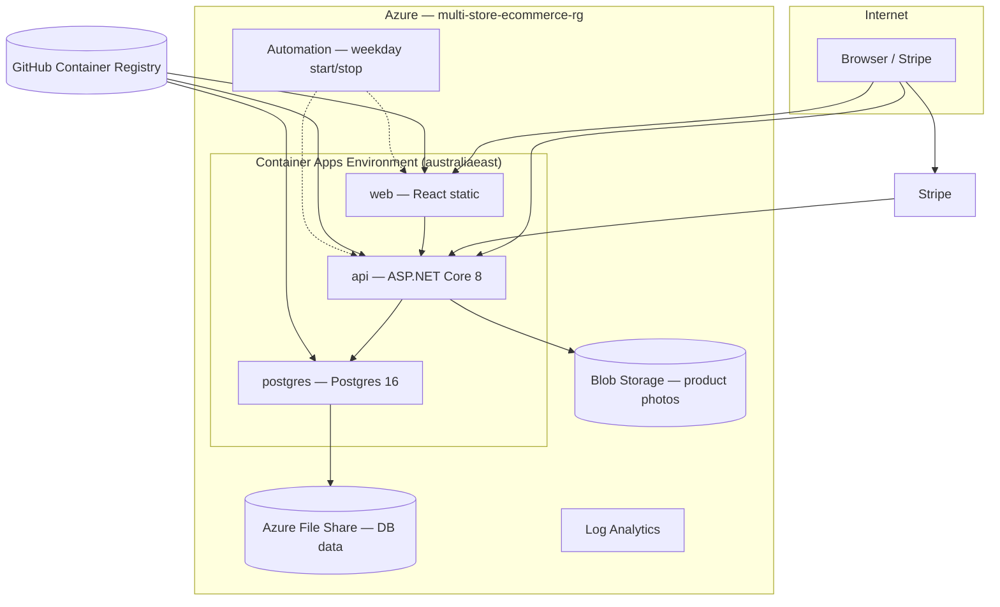

# Azure Infrastructure (Terraform)

Infrastructure as Code for the **Multi-Store E-Commerce Platform** — a full-stack portfolio project deployable to **Azure Container Apps** with cost-aware scheduling, GitHub Actions CI/CD, and a single shared resource group for showcase/demo use.

Use this document for **DevOps / platform** interviews. Pair it with the **[root README](../../README.md)** for application features, local development, and full-stack context.

---

## Portfolio highlights (resume talking points)

### DevOps / Platform

- **Terraform modules** for Container Apps, Postgres, storage, blob photos, and weekday Automation schedules
- **GitHub Actions** — CI on PR/push; deploy to Azure via **OIDC** (no long-lived Azure secrets in GitHub)
- **GHCR** image pipeline — build, tag (`production` / `staging` + commit SHA), push, update ACA revisions
- **Scale-to-zero** for API/web outside demo hours; Postgres kept warm for **Azure Files + WAL** reliability
- Custom **Postgres 16** image on Azure File Share (`infra/docker/postgres-azurefiles`)
- Remote **Terraform state** in Azure Storage; separate state keys per environment

### Full-stack

- **React 18 + Vite + Tailwind** storefront and admin dashboard → **ASP.NET Core 8** API → **PostgreSQL 16**
- Stripe Checkout, webhooks, invoice PDF, role-based auth (admin / store_manager / staff / customer)
- Azure Blob product media, Azure Communication Services email

### Frontend

- Responsive storefront, cart/checkout, dashboard CRUD (products, stores, vouchers, users)
- Redux Toolkit auth, Zod form validation, accessible loading states

---

## Architecture



**Traffic path:** `web` → `api` → `postgres` (internal ACA ingress). Photos served from Blob Storage. Stripe calls the public API webhook URL.

**Single stack:** One resource group hosts the live demo. Terraform is applied from `environments/staging/`; GitHub deploys `:staging` from `develop` and `:production` from `main` to the same ACA apps.

---

## Scale profile (showcase / cost-aware)

| Component | Idle behaviour | Notes |
|-----------|----------------|-------|
| **web** | `min_replicas = 0` | No compute cost when scaled down |
| **api** | `min_replicas = 0` | Same |
| **postgres** | `min_replicas = 1` | Stays warm — avoids WAL corruption on Azure Files after abrupt shutdown |
| **Schedule** | Mon–Fri 10:00–17:00 Australia/Sydney | Automation scales api/web up; stop runbook scales api/web down only |
| **Manual** | `scripts/aca-start.sh` / `aca-stop.sh` | Start/stop outside Automation hours |

Approximate monthly cost (pay-as-you-go, light demo usage): **~AU$15–25** depending on Postgres uptime and showcase hours. Postgres 24/7 alone is roughly **~USD 8–12/month** compute. Azure Budgets alert only — they do **not** auto-stop resources.

---

## Repository layout

```text
infra/terraform/
├── modules/                 # Reusable modules — see modules/README.md
│   ├── aca_schedule/        # Azure Automation weekday start/stop (Free tier)
│   ├── api_app/             # .NET API Container App
│   ├── web_app/             # React web Container App
│   ├── postgres_app/        # Postgres on Azure Files mount
│   ├── photos_storage/      # Optional product-photos blob account
│   ├── storage/             # File share for Postgres data
│   └── ...
├── scripts/
│   ├── aca-start.sh         # Scale postgres + api + web up
│   └── aca-stop.sh          # Scale api + web to zero (postgres stays at 1)
└── environments/
    ├── shared/              # Optional ACR (skip when use_acr = false)
    ├── staging/             # Primary apply target for the live stack
    └── production/          # Alternate tfvars profile (same modules)
```

---

## Terraform modules

| Module | Purpose |
|--------|---------|
| `resource_group` | Create or reference existing RG |
| `log_analytics` | ACA diagnostics |
| `storage` | Azure Files share for Postgres `PGDATA` |
| `photos_storage` | Blob account + container for product images |
| `container_apps_environment` | CAE + volume mount for Postgres |
| `postgres_app` | Postgres 16 Container App (custom GHCR image) |
| `api_app` / `web_app` | Public ACA services (GHCR or optional ACR) |
| `aca_schedule` | Weekday Automation runbooks (start: postgres → api → web; stop: web → api) |

---

## CI/CD (GitHub Actions)

| Workflow | Trigger | What it does |
|----------|---------|--------------|
| **CI** | PR / push to `develop`, `main` | Backend build + unit/integration tests; frontend build + tests |
| **Deploy Staging** | Push to `develop` | Build/push GHCR `:staging` + `:sha-*` → update ACA → scale up → API health smoke test |
| **Deploy Production** | Push to `main` | Same with `:production` tag |
| **Terraform Plan / Apply** | Manual | Infra changes via OIDC |

**Deploy details:**

- API and web Container Apps are updated with **commit SHA tags** so each deploy creates a new revision (avoids stale `:production` / `:staging` pulls).
- Postgres image rebuild/deploy runs **only** when `infra/docker/postgres-azurefiles/**` changes.
- After deploy, workflow scales apps up and retries `/api/health` for cold-start tolerance.

See [`.github/azure-github-config.example.md`](../../.github/azure-github-config.example.md) for OIDC and GitHub Environment variables (`API_URL`, `VITE_*`, `AZURE_*`).

---

## Prerequisites

- [Terraform](https://www.terraform.io/downloads) >= 1.5
- [Azure CLI](https://learn.microsoft.com/cli/azure/install-azure-cli) — `az login`
- Contributor on subscription / resource group
- GitHub OIDC federated credentials for deploy workflows
- **GHCR:** packages `multi-store-api`, `multi-store-web`, `multi-store-postgres` set to **Public** (anonymous ACA pull) unless registry credentials are added

| Setting | Default |
|---------|---------|
| Resource group | `multi-store-ecommerce-rg` |
| Region (RG) | `australiacentral` |
| Container Apps | `australiaeast` |

---

## Bootstrap remote state (one time)

Creates the Azure Storage account and container for Terraform state.

```bash
RG=multi-store-ecommerce-rg
LOC=australiacentral
SA=tfstatemultistore   # must be globally unique — change if taken

az storage account create -g $RG -n $SA -l $LOC --sku Standard_LRS
az storage container create --account-name $SA -n tfstate
```

Copy backend config per environment:

```bash
cd infra/terraform/environments/staging
cp backend.hcl.example backend.hcl
```

---

## Apply order (GHCR showcase — no ACR)

```bash
cd infra/terraform/environments/staging
cp terraform.tfvars.example terraform.tfvars   # fill secrets + storage_account_name
terraform init -backend-config=backend.hcl
terraform plan
terraform apply
```

Optional ACR path: apply `environments/shared` first, then set `use_acr = true` in tfvars. Default showcase profile uses **GHCR only** (`use_acr = false`).

**Before first apply**, ensure images exist on GHCR (push to `develop` / `main`, or build locally):

```bash
echo $GITHUB_TOKEN | docker login ghcr.io -u YOUR_GITHUB_USER --password-stdin

docker build -t ghcr.io/YOUR_USER/multi-store-api:staging ./backend
docker push ghcr.io/YOUR_USER/multi-store-api:staging

docker build -t ghcr.io/YOUR_USER/multi-store-web:staging \
  --build-arg VITE_API_BASE_URL=https://YOUR_API_URL \
  --build-arg VITE_PRODUCT_MEDIA_BASE_URL=https://YOUR_BLOB_URL/product-photos \
  --build-arg VITE_SUPPORT_EMAIL=you@example.com \
  ./frontend
docker push ghcr.io/YOUR_USER/multi-store-web:staging

docker build -t ghcr.io/YOUR_USER/multi-store-postgres:staging ./infra/docker/postgres-azurefiles
docker push ghcr.io/YOUR_USER/multi-store-postgres:staging
```

---

## Manual start / stop

```bash
export AZURE_RESOURCE_GROUP=multi-store-ecommerce-rg

bash infra/terraform/scripts/aca-start.sh   # postgres → wait → api → web
bash infra/terraform/scripts/aca-stop.sh    # api + web to zero; postgres stays at 1
```

Outside Automation hours (or after `aca-stop.sh`), the public URLs return errors until you run `aca-start.sh` or wait for the weekday start schedule.

---

## Database schema

After Postgres is running:

```bash
psql "host=..." -f database/Database-Schema-Generated.sql
```

Use the internal ACA FQDN or a temporary port-forward for initial seeding.

---

## Post-deploy configuration

1. Run `terraform output web_url` and `api_url`.
2. Update `terraform.tfvars`: `cors_allowed_origins`, `public_app_base_url`.
3. `terraform apply` again if tfvars changed.
4. Update GitHub Environment variables: `API_URL`, `VITE_API_BASE_URL`, `VITE_PRODUCT_MEDIA_BASE_URL`, etc.
5. Configure Stripe webhook → `{API_URL}/api/webhooks/stripe`.

---

## End-to-end deploy flow (typical)

1. **Local:** `terraform apply` (after bootstrap) — creates ACA, storage, Automation, secrets wiring.
2. **GitHub:** Set Environment secrets/vars (OIDC, Stripe, JWT, …).
3. **Code:** merge to `develop` (staging tags) or `main` (production tags).
4. **Actions:** build → GHCR → `az containerapp update` with SHA tag → scale up → health check.
5. **Demo:** site live at Terraform `web_url` / `api_url` outputs.

`terraform apply` does **not** deploy application code — a git push to `develop` or `main` does.

---

## Secrets

Never commit `terraform.tfvars`, `backend.hcl`, or `backend/.env`. Only `*.example` files are tracked in git.

Terraform variable names are project-specific; each `resource` block must match the Azure provider schema for the installed provider version.

---

## Troubleshooting

| Issue | Fix |
|-------|-----|
| Container App `ImagePullBackOff` | GHCR packages must be **public**, or add registry credentials to ACA |
| 503 / timeout outside hours | Run `aca-start.sh` or wait until weekday 10:00 schedule |
| API unhealthy after deploy | Cold start 1–3 min; deploy workflow retries health; check Postgres logs |
| Live site missing latest frontend | Ensure deploy uses SHA tag on `az containerapp update` (see deploy workflows) |
| Postgres crash / permission denied on Azure File | Use `multi-store-postgres` image; `PGDATA=/mnt/postgres-data`; SMB `uid=70`; see `infra/docker/postgres-azurefiles` |
| WAL / checkpoint errors after scale-to-zero | Keep `aca_postgres_min_replicas = 1`; do not stop postgres in stop runbook |
| Automation runbook failed | Portal → Automation account → Job logs; identity needs Contributor on RG |

---

## Related documentation

- **[Root README](../../README.md)** — project overview, local dev, features, tests
- [Terraform modules guide](modules/README.md) — module mental model
- [Postgres Azure Files image](../docker/postgres-azurefiles/README.md)
- [GitHub Azure OIDC setup](../../.github/azure-github-config.example.md)
- [Deploy staging workflow](../../.github/workflows/deploy-staging.yml)
- [Deploy production workflow](../../.github/workflows/deploy-production.yml)
